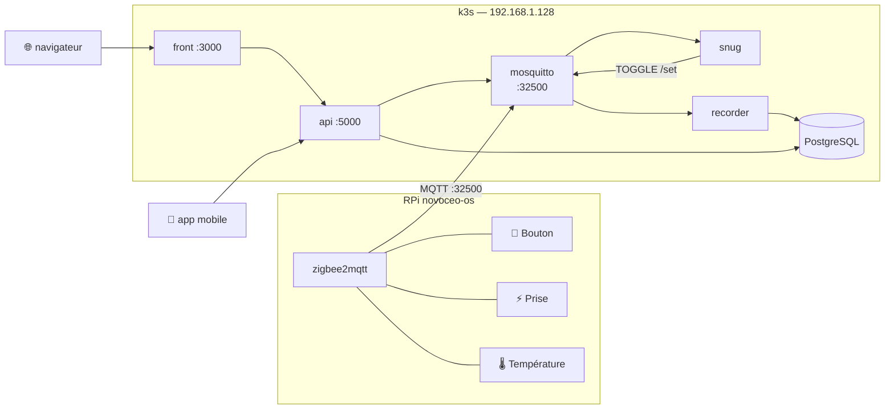

# novoceo

Monitoring et contrôle d'appareils Zigbee via Zigbee2MQTT, MQTT et une API REST.

## Vue d'ensemble



**Flux principal** : Bouton (Zigbee) -> zigbee2mqtt -> MQTT -> snug -> Prise (TOGGLE)

**Flux data** : Tous les events -> recorder -> PostgreSQL -> api -> front / mobile

> Diagramme complet avec séquence dans [docs/architecture.md](docs/architecture.md)

## Composants

| Service | Rôle | Port | Replicas |
|---------|------|------|----------|
| **mosquitto** | Broker MQTT central — bridge HA | NodePort 32500 (k3s) | 2 StatefulSet |
| **snug** | Ecoute le bouton, envoie TOGGLE à la prise | — | 1 |
| **recorder** | Persiste tous les events en PostgreSQL | — | 1 |
| **api** | REST : commandes + lecture BDD | 5000 | 2 |
| **front** | Dashboard web HTMX | 3000 | 2 |
| **mobile** | App Android React Native / Expo | — | — |
| **monitor** | Dashboard ANSI terminal (dev) | — | — |
| **send-device** | CLI one-shot pour envoyer une commande | — | — |

## Raspberry Pi

Le RPi fait tourner Zigbee2MQTT. Les scripts de gestion sont dans `rpi/`.

### Sauvegarde de la carte SD

Brancher la carte SD sur le laptop, puis :

```bash
# Détecter le périphérique
sudo ./rpi/backup-sd.sh detect

# Sauvegarder
sudo ./rpi/backup-sd.sh backup /dev/sdb

# Lister les sauvegardes (3 dernières conservées)
sudo ./rpi/backup-sd.sh list

# Restaurer
sudo ./rpi/backup-sd.sh restore /dev/sdb
```

Les sauvegardes sont stockées dans `rpi/backups/` (exclu de git), au format `rpi_sd_YYYYMMDD_HHMMSS.img.gz`.
Installer `pv` pour une barre de progression avec vitesse et ETA.

## Domaines exposés (k3s + Ingress nginx + TLS)

- Dashboard web : `https://novoceo.front.local.happyapi.fr`
- API REST : `https://novoceo.api.local.happyapi.fr`

## Documentation détaillée

- [Architecture et topologie MQTT](docs/architecture.md)
- [API REST](docs/api.md)
- [Application mobile Android](docs/mobile.md)
- [Déploiement Kubernetes](docs/kubernetes.md)
- [Développement local](docs/dev.md)
- [Base de données](docs/database.md)
