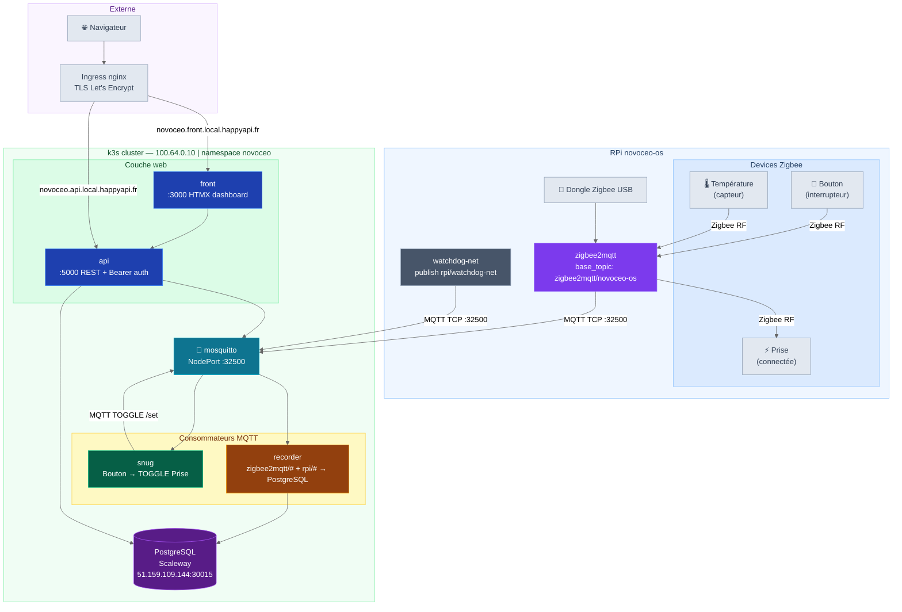
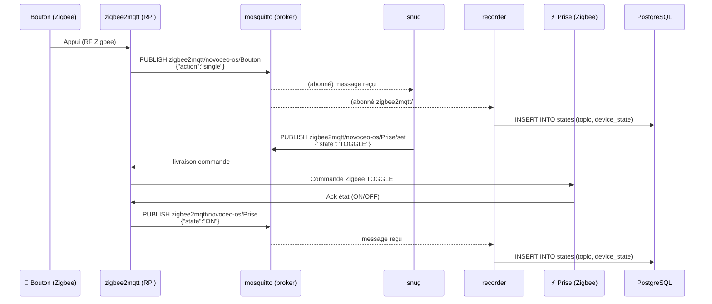

# Architecture et topologie MQTT

## Diagramme d'architecture



## Topologie réseau (ASCII)

## Topics MQTT

Zigbee2MQTT du RPi publie sur le broker central avec son hostname comme préfixe :

```
zigbee2mqtt/<rpi>/<device>        # état d'un device (ex: zigbee2mqtt/novoceo-os/Bouton)
zigbee2mqtt/<rpi>/<device>/set    # commande vers un device
zigbee2mqtt/<rpi>/bridge/devices  # liste des devices Zigbee du RPi
zigbee2mqtt/<rpi>/bridge/health   # état de santé du bridge
zigbee2mqtt/bridge/health         # santé du bridge local (si zigbee2mqtt local)
```

Le watchdog réseau publie sur un topic distinct :

```
rpi/watchdog-net                  # heartbeat toutes les minutes + event reboot
```

Payload heartbeat : `{"event":"heartbeat","loss":N}` (N = % paquets perdus)
Payload reboot : `{"event":"reboot","loss":N}`

### Appuyer sur le bouton — flux complet



## Configuration zigbee2mqtt sur le RPi

Le RPi `novoceo-os` doit avoir dans `configuration.yaml` de zigbee2mqtt :

```yaml
mqtt:
  server: mqtt://100.64.0.10:32500   # broker central sur k3s
  base_topic: zigbee2mqtt/novoceo-os   # préfixe = hostname du RPi
```

Zigbee2MQTT tourne en tant que service systemd sur le RPi (`rpi/zigbee2mqtt.service`).

```bash
# Copier le service sur le RPi
sudo cp rpi/zigbee2mqtt.service /etc/systemd/system/
sudo systemctl daemon-reload
sudo systemctl enable --now zigbee2mqtt

# Opérations courantes
sudo systemctl status zigbee2mqtt
sudo systemctl restart zigbee2mqtt
journalctl -u zigbee2mqtt -f
```

> Adapter `User=jerome` dans le fichier service si l'utilisateur système est différent.

## Noms des devices

Les friendly names sont définis dans zigbee2mqtt et utilisés partout :

| Friendly name | Type | Usage |
|---------------|------|-------|
| `Bouton` | Interrupteur Zigbee | Déclencheur snug |
| `Prise` | Prise connectée Zigbee | Cible du TOGGLE |
| `Température` | Capteur temp/humidity | Affiché dans front/api |

## Règles de routage snug

snug souscrit à deux topics pour gérer les deux formats :

```
zigbee2mqtt/Bouton          # format local (zigbee2mqtt sans préfixe RPi)
zigbee2mqtt/+/Bouton        # format multi-RPi (wildcard sur le nom du RPi)
```

Flag `-action single` : filtre sur le champ `action` du payload pour éviter
le double-toggle sur les appuis longs ou double-clic.
